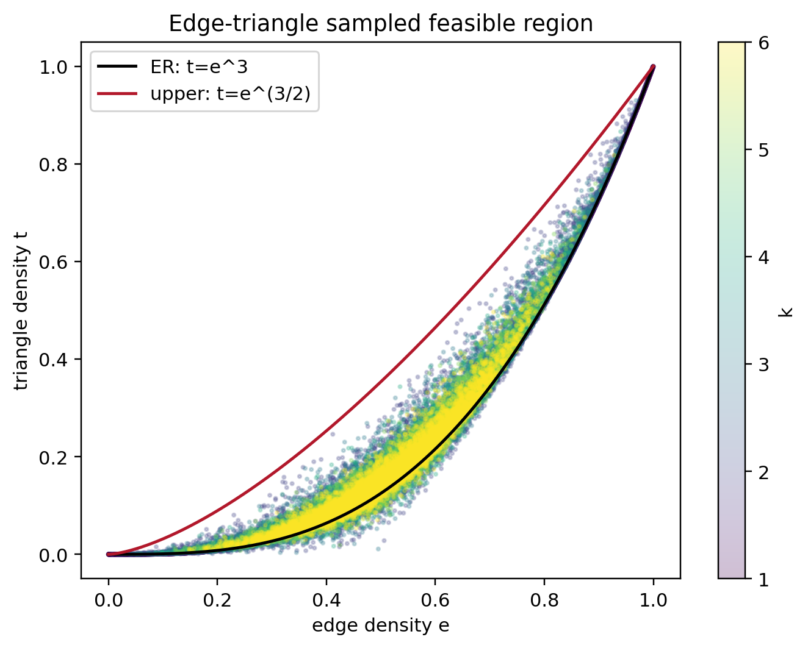
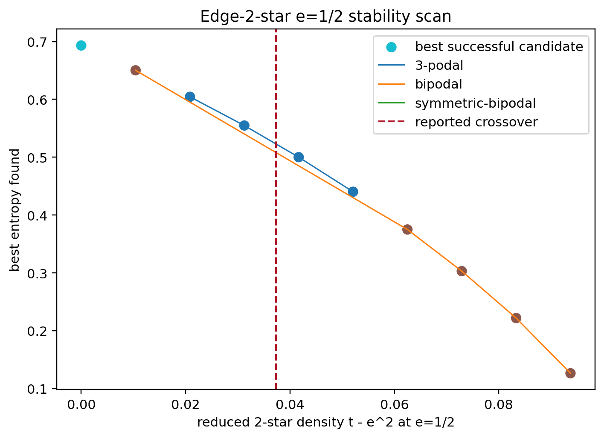
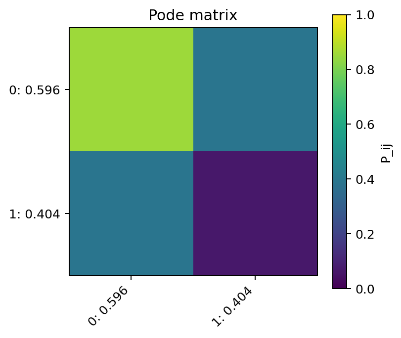

# graphon-space

`graphon-space` is a numerical discovery tool for exploring feasible `(e,t)`
regions and entropy-maximizing step graphons. It supports the edge-triangle and
edge-2-star models, symmetric and unrestricted bipodal baselines, general
`k`-podal graphons, structured clique-like and anti-clique-like starts, plotting,
and a command-line interface.

The implementation is intentionally numerical rather than a proof engine. Its
main purpose is to test symmetric bipodal candidates against broader families
instead of assuming them optimal.

## Current Workspace Status

This workspace already contains a completed first-pass numerical run under:

- Data: `outputs/final/data/`
- Figures: `outputs/final/figures/`
- Summary report: `outputs/final/final_report.md`
- Analysis notebooks: `notebooks/`

The run produced:

- `60,000` edge-triangle samples for `k=1..6`
- `60,000` edge-2-star samples for `k=1..6`
- fixed-edge boundary searches for both models
- two targeted family comparisons
- coarse entropy-grid/phase-map outputs
- an edge-2-star `e=1/2` stability scan

Validation from `outputs/final/final_report.md`:

- triangle max-boundary median absolute error vs `e^(3/2)`: `4.396e-12`
- edge-2-star max-boundary median absolute error vs the known envelope: `7.841e-14`
- triangle target `e=0.35, t=0.02` winner: bipodal, classified as symmetric-bipodal
- edge-2-star target `e=0.5, t=0.29` winner: bipodal, classified as nonsymmetric-bipodal

## Representative Figures







## Setup

From this workspace:

```powershell
.\.venv\Scripts\python.exe -m pip install -e .[dev]
.\.venv\Scripts\python.exe -m pytest
```

If `.venv` is missing, create it with the Python available on your machine, then
install the package:

```powershell
python -m venv .venv
.\.venv\Scripts\python.exe -m pip install --upgrade pip
.\.venv\Scripts\python.exe -m pip install -e .[dev]
```

## Reproducing The Completed Run

The exact data-producing commands used for the first-pass figure pack were:

```powershell
.\.venv\Scripts\graphon-space.exe sample --model triangle --kmax 6 --samples 60000 --sampler sobol --seed 20260523 --out outputs\final\data\samples_triangle.parquet
.\.venv\Scripts\graphon-space.exe sample --model two-star --kmax 6 --samples 60000 --sampler sobol --seed 20260524 --out outputs\final\data\samples_2star.parquet

.\.venv\Scripts\graphon-space.exe boundary --model triangle --kmax 4 --e-grid 31 --starts 6 --seed 20260525 --out outputs\final\data\boundary_triangle.parquet
.\.venv\Scripts\graphon-space.exe boundary --model two-star --kmax 4 --e-grid 31 --starts 6 --seed 20260526 --out outputs\final\data\boundary_2star.parquet

.\.venv\Scripts\graphon-space.exe compare --model triangle --edge 0.35 --t 0.02 --kmax 5 --starts 12 --seed 20260527 --mode hybrid --out outputs\final\data\compare_triangle_e035_t002.parquet
.\.venv\Scripts\graphon-space.exe compare --model two-star --edge 0.5 --t 0.29 --kmax 5 --starts 12 --seed 20260528 --mode hybrid --out outputs\final\data\compare_2star_e05_t029.parquet

.\.venv\Scripts\graphon-space.exe optimize-grid --model triangle --kmax 3 --grid 3x3 --starts 1 --seed 20260602 --mode hybrid --out outputs\final\data\entropy_grid_triangle.parquet
.\.venv\Scripts\graphon-space.exe optimize-grid --model two-star --kmax 3 --grid 5x5 --starts 2 --seed 20260601 --mode hybrid --out outputs\final\data\entropy_grid_2star.parquet

.\.venv\Scripts\graphon-space.exe stability --model two-star --edge 0.5 --t-tilde-grid 13 --kmax 3 --starts 2 --seed 20260603 --mode hybrid --out outputs\final\data\stability_2star_e05.parquet
```

The fixed-edge constructive `A,B,c` tripodal search can be run with:

```powershell
.\.venv\Scripts\graphon-space.exe constructive --edge 0.4 --ab-samples 1000 --c-samples 100 --seed 20260604 --out outputs\constructive_e04.parquet
```

The CLI plot commands used for the basic generated figures were:

```powershell
.\.venv\Scripts\graphon-space.exe plot --input outputs\final\data\samples_triangle.parquet --kind scatter --out outputs\final\figures\scatter_triangle.png
.\.venv\Scripts\graphon-space.exe plot --input outputs\final\data\samples_2star.parquet --kind scatter --out outputs\final\figures\scatter_2star.png
.\.venv\Scripts\graphon-space.exe plot --input outputs\final\data\boundary_triangle.parquet --kind boundary --out outputs\final\figures\boundary_triangle.png
.\.venv\Scripts\graphon-space.exe plot --input outputs\final\data\boundary_2star.parquet --kind boundary --out outputs\final\figures\boundary_2star.png
.\.venv\Scripts\graphon-space.exe plot --input outputs\final\data\entropy_grid_triangle.parquet --kind entropy --out outputs\final\figures\entropy_triangle.png
.\.venv\Scripts\graphon-space.exe plot --input outputs\final\data\entropy_grid_2star.parquet --kind entropy --out outputs\final\figures\entropy_2star.png
.\.venv\Scripts\graphon-space.exe plot --input outputs\final\data\entropy_grid_triangle.parquet --kind phase-map --out outputs\final\figures\phase_triangle.png
.\.venv\Scripts\graphon-space.exe plot --input outputs\final\data\entropy_grid_2star.parquet --kind phase-map --out outputs\final\figures\phase_2star.png
.\.venv\Scripts\graphon-space.exe plot --input outputs\final\data\entropy_grid_triangle.parquet --kind sym-gap --out outputs\final\figures\sym_gap_triangle.png
.\.venv\Scripts\graphon-space.exe plot --input outputs\final\data\entropy_grid_2star.parquet --kind sym-gap --out outputs\final\figures\sym_gap_2star.png
.\.venv\Scripts\graphon-space.exe plot --input outputs\final\data\compare_triangle_e035_t002.parquet --kind pode --row 0 --out outputs\final\figures\pode_triangle_compare_winner.png
.\.venv\Scripts\graphon-space.exe plot --input outputs\final\data\compare_2star_e05_t029.parquet --kind pode --row 1 --out outputs\final\figures\pode_2star_compare_winner.png
```

The higher-signal overlay figures and final report are generated by:

```powershell
.\.venv\Scripts\python.exe scripts\make_final_figures.py
```

## Notebooks

The notebooks load the existing `outputs/final/data/*.parquet` files and
regenerate analysis plots in memory:

- `notebooks/01_feasible_region_edge_triangle.ipynb`: edge-triangle feasible region and boundary validation.
- `notebooks/02_entropy_search_edge_triangle.ipynb`: edge-triangle family comparison and coarse entropy-grid analysis.
- `notebooks/03_edge_2star_symmetry_breaking.ipynb`: edge-2-star feasible region, boundary validation, and `e=1/2` stability scan.
- `notebooks/04_compare_symmetric_vs_general_bipodal.ipynb`: symmetric-bipodal gap checks and pode heatmaps.

## Package Layout

- `graphon_space.graphon`: `StepGraphon` representation.
- `graphon_space.densities`: edge, triangle, 2-star, reduced 2-star, and entropy.
- `graphon_space.families`: ER, symmetric bipodal, bipodal, `k`-podal, and structured constructors.
- `graphon_space.sampling`: random, boundary-biased, Latin hypercube, and Sobol sampling.
- `graphon_space.optimize`: fixed-target entropy search and family comparison.
- `graphon_space.boundary`: fixed-edge min/max boundary searches and known envelope helpers.
- `graphon_space.constructive`: fixed-edge `A,B,c` tripodal construction and search.
- `graphon_space.phase`: symmetry classification and winner summaries.
- `graphon_space.diagnostics`: residuals, duplicate-pode checks, finite-difference Hessians.
- `graphon_space.visualize`: scatter, boundary, entropy, phase, gap, and pode heatmap plots.
- `graphon_space.cli`: command-line entry point.

## Entropy Convention

Entropy is stored using the edge-triangle convention:

```text
S(c,P) = sum_ij c_i c_j H(P_ij)
H(u) = -u log u - (1-u) log(1-u)
```

Some edge-2-star papers differ by a constant normalization. That does not
change optimizers, but it does affect reported entropy values.

## Numerical Caveats

- Dense `optimize-grid` runs are much more expensive than sampling or boundary
  validation. The current triangle grid is deliberately coarse because broad
  rectangular `(e,t)` grids include many infeasible or hard cells.
- For larger Sobol runs, use a power-of-two sample count such as `65536` to keep
  Sobol balance properties exact.

## Citation

The edge-2-star experiments and validation targets are based in part on:

Charles Radin and Lorenzo Sadun, "Optimal graphons in the edge-2star model,"
arXiv:2305.00333, 2023. <https://arxiv.org/abs/2305.00333>

